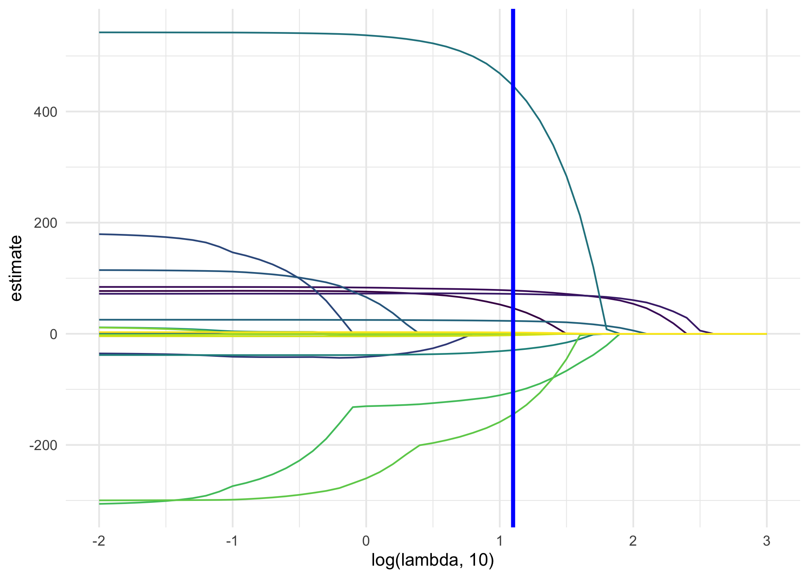
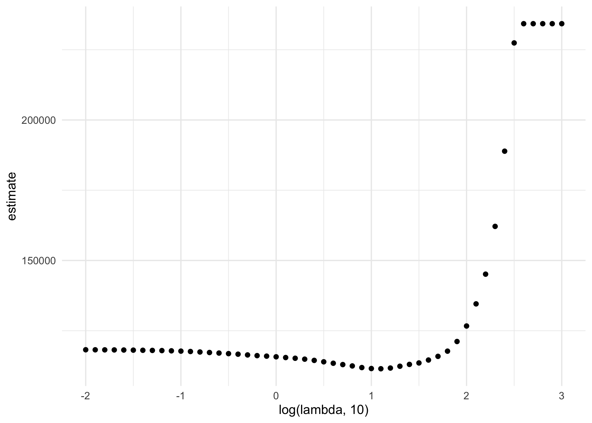
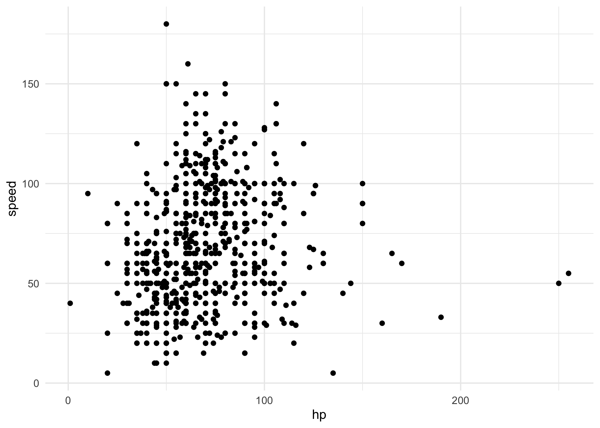
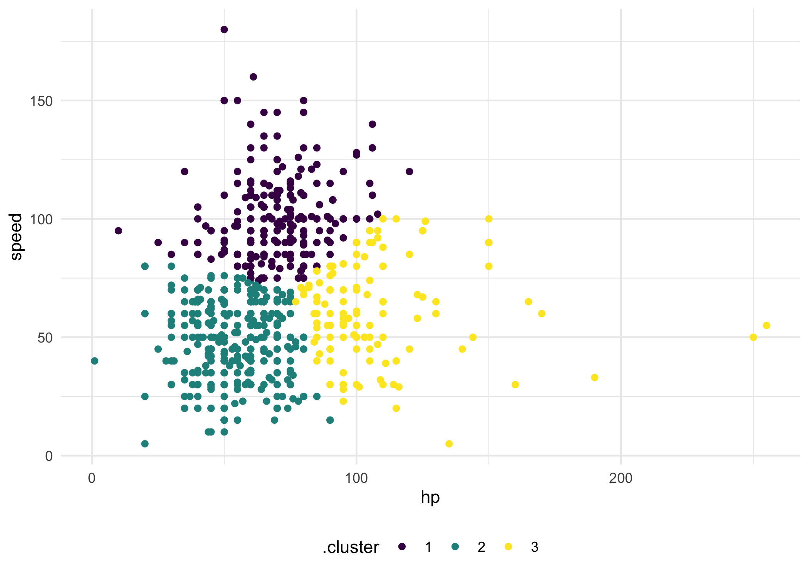

Statistical Learning
================
Tianshu Liu

# LASSO

``` r
bwt_df = 
  read_csv("./data/birthweight.csv") %>% 
  janitor::clean_names() %>%
  mutate(
    babysex = as.factor(babysex),
    babysex = fct_recode(babysex, "male" = "1", "female" = "2"),
    frace = as.factor(frace),
    frace = fct_recode(frace, "white" = "1", "black" = "2", "asian" = "3", 
                       "puerto rican" = "4", "other" = "8"),
    malform = as.logical(malform),
    mrace = as.factor(mrace),
    mrace = fct_recode(mrace, "white" = "1", "black" = "2", "asian" = "3", 
                       "puerto rican" = "4")) %>% 
  sample_n(200)

x = model.matrix(bwt ~ ., bwt_df)[,-1]
y = bwt_df$bwt
```

``` r
lambda = 10^(seq(3, -2, -0.1))

lasso_fit =
  glmnet(x, y, lambda = lambda)

lasso_cv =
  cv.glmnet(x, y, lambda = lambda)

lambda_opt = lasso_cv$lambda.min
```

``` r
broom::tidy(lasso_fit) %>% 
  select(term, lambda, estimate) %>% 
  complete(term, lambda, fill = list(estimate = 0) ) %>% 
  filter(term != "(Intercept)") %>% 
  ggplot(aes(x = log(lambda, 10), y = estimate, group = term, color = term)) + 
  geom_path() + 
  geom_vline(xintercept = log(lambda_opt, 10), color = "blue", size = 1.2) +
  theme(legend.position = "none")
```



``` r
broom::tidy(lasso_cv) %>% 
  ggplot(aes(x = log(lambda, 10), y = estimate)) + 
  geom_point()  
```



``` r
lasso_fit = 
  glmnet(x, y, lambda = lambda_opt)

lasso_fit %>% broom::tidy()
```

    ## # A tibble: 12 × 5
    ##    term               step  estimate lambda dev.ratio
    ##    <chr>             <dbl>     <dbl>  <dbl>     <dbl>
    ##  1 (Intercept)           1 -3659.      12.6     0.627
    ##  2 babysexfemale         1    46.2     12.6     0.627
    ##  3 bhead                 1    77.9     12.6     0.627
    ##  4 blength               1    71.8     12.6     0.627
    ##  5 fincome               1     0.252   12.6     0.627
    ##  6 gaweeks               1    23.1     12.6     0.627
    ##  7 malformTRUE           1   447.      12.6     0.627
    ##  8 menarche              1   -29.4     12.6     0.627
    ##  9 mraceblack            1  -105.      12.6     0.627
    ## 10 mracepuerto rican     1  -145.      12.6     0.627
    ## 11 smoken                1    -2.62    12.6     0.627
    ## 12 wtgain                1     2.32    12.6     0.627

# Clustering

``` r
poke_df = 
  read_csv("./data/pokemon.csv") %>% 
  janitor::clean_names() %>% 
  select(hp, speed)


poke_df %>% 
  ggplot(aes(x = hp, y = speed)) + 
  geom_point()
```



``` r
# run k means
kmeans_fit =
  kmeans(x = poke_df, centers = 3)

broom::augment(kmeans_fit, poke_df) %>% 
  ggplot(aes(x = hp, y = speed, color = .cluster)) +
  geom_point()
```



``` r
clusts =
  tibble(k = 2:4) %>%
  mutate(
    km_fit =    map(k, ~kmeans(poke_df, .x)),
    augmented = map(km_fit, ~broom::augment(.x, poke_df))
  )

clusts %>% 
  select(-km_fit) %>% 
  unnest(augmented) %>% 
  ggplot(aes(hp, speed, color = .cluster)) +
  geom_point(aes(color = .cluster)) +
  facet_grid(~k)
```


